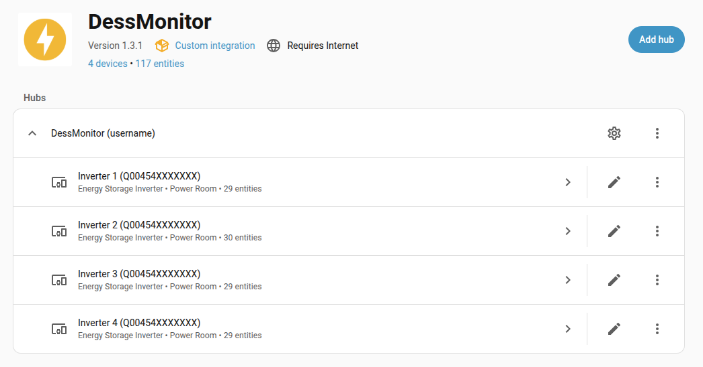
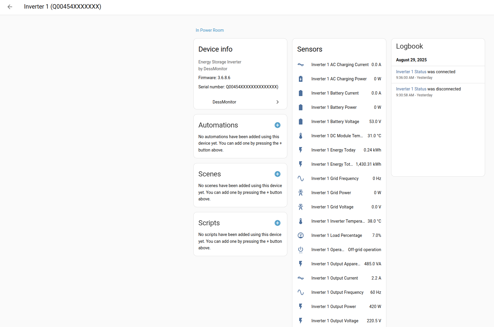

# DessMonitor Home Assistant Integration

[![GitHub Release][releases-shield]][releases]
[![GitHub Activity][commits-shield]][commits]
[![License][license-shield]](LICENSE)

[![hacs][hacsbadge]][hacs]
[![HACS Action][hacs-action-shield]][hacs-action]
[![Hassfest][hassfest-shield]][hassfest]

[![Project Maintenance][maintenance-shield]][user_profile]
[![Community Forum][forum-shield]][forum]

A Home Assistant integration for monitoring solar inverters via DessMonitor/SmartESS platform with periodic updates (5-minute default; 1-minute with Detailed Data Collection Acceleration).

> **Also known as:** SmartESS, WatchPower, Energy-Mate, Fronus Solar, or other Eybond cloud-based monitoring platforms. This integration works with any inverter system that reports to the DessMonitor web platform (www.dessmonitor.com).

## 🧰 Supported Inverter Brands

DessMonitor/SmartESS data collectors are typically installed alongside inverter systems from a variety of brands. This integration targets the DessMonitor backend and therefore works across many rebrands/OEM models that use the same platform.

- PowMr
- EASUN Power
- MPP Solar
- MUST Power
- Voltronic Power “Axpert” rebrands (various regional labels)
- Fronus Solar

Notes:
- This is a non-exhaustive list. Many Axpert/Voltronic-derived models and regional rebrands work when connected via a DessMonitor/SmartESS data collector.
- If your installer provided SmartESS or DessMonitor app access, or your system uses WatchPower/Energy‑Mate and logs into dessmonitor.com, it’s very likely supported.
- Don’t see your brand? If it reports to https://www.dessmonitor.com/ with a collector on your account, it should work. Open an issue with your device details if unsure.

## 📚 Table of Contents

- [🚀 Quick Start](#-quick-start)
- [🌟 Features](#-features)
- [🖼️ Screenshots](#-screenshots)
- [📊 Available Sensors](#-available-sensors)
- [🚀 Installation](#-installation)
- [⚙️ Configuration](#%EF%B8%8F-configuration)
- [🔧 Advanced Configuration](#-advanced-configuration)
- [🛠️ Troubleshooting](#%EF%B8%8F-troubleshooting)
- [🛠️ Development Tools](#%EF%B8%8F-development-tools)
- [🤝 Contributing](#-contributing)
- [📞 Support](#-support)

## 🚀 Quick Start

**New to DessMonitor Integration? Get started in 3 steps:**

[](https://my.home-assistant.io/redirect/hacs_repository/?owner=andreas-glaser&repository=ha-dessmonitor&category=Integration)
1. **Install via HACS**: 
2. **Restart** Home Assistant
3. **Add Integration**: Go to Settings → Devices & Services → Add Integration → "DessMonitor"

**Already have an account?** Enter your DessMonitor credentials and you're monitoring your solar system in minutes!

## 🌟 Features

- Periodic monitoring of multiple inverters/collectors (5-minute default)
- 1-minute updates available with Detailed Data Collection Acceleration (￥144 per collector)
- Comprehensive sensor data: Power, voltage, current, frequency, temperature, and more
- UI-based configuration - No YAML editing required
- Automatic device discovery for all inverters on your account
- Configurable update intervals (1-60 minutes based on your subscription)
- Secure token-based authentication with automatic renewal
- Energy Dashboard integration for production/consumption tracking
- Smart device naming with collector part numbers for easy identification

## 🖼️ Screenshots





## 📊 Available Sensors

### Power Monitoring
- **Output Power** (W) - Current inverter output
- **Total PV Power** (kW) - Solar output at last update interval
- **Battery Power** (W) - Charging/discharging power (+ = charging, - = discharging)  
- **Solar Power** (W) - Current solar panel generation
- **Grid Power** (W) - Grid import/export power
- **PV Charge Power** (W) - Solar charging power to batteries
- **AC Charging Power** (W) - Grid charging power to batteries

### Electrical Measurements
- **Voltages** (V) - Output, Battery, Solar voltages
- **Currents** (A) - Output, Battery, Solar currents
- **Frequencies** (Hz) - Output and Grid frequency monitoring

### Energy Tracking
- **Energy Today** (kWh) - Daily energy production per inverter
- **Energy Total** (kWh) - Lifetime energy production per inverter
- **Output Apparent Power** (VA) - Total apparent power output

### System Status  
- **Load Percentage** (%) - Current system load
- **Operating Mode** - Off-Grid, Grid, Hybrid, Standby, Fault, or Shutdown Approaching
- **Device Connectivity** - Online/offline status
- **Temperatures** (°C) - Inverter and DC module temperatures

### Diagnostic Sensors (Disabled by Default)
The integration provides several diagnostic sensors that show battery and inverter configuration settings. These sensors are **disabled by default** to keep your dashboard clean, but can be selectively enabled as needed:

- **Output Priority** - Power source priority setting (SBU, SUB, UTI, SOL)
- **Charger Source Priority** - Battery charging source preference
- **Output Voltage Setting** (V) - Configured output voltage target (e.g., 220.0V)

#### Enabling Diagnostic Sensors
1. Go to **Settings** > **Devices & Services** > **DessMonitor**
2. Click on your device (e.g., "Inverter 1")
3. Find the diagnostic sensor you want to enable
4. Click the sensor and toggle **"Enable"**
5. The sensor will now appear in your dashboard and be available for automations

### Additional Measurement Sensors
- **AC Charging Current** (A) - Current from grid charging
- **PV Charging Current** (A) - Current from solar charging

## 🚀 Installation

### Method 1: HACS (Recommended)

[](https://my.home-assistant.io/redirect/hacs_repository/?owner=andreas-glaser&repository=ha-dessmonitor&category=Integration)

1. **Install HACS** if you haven't already
2. **Click the button above** or add custom repository manually:
   - Go to HACS > Integrations > ⋮ > Custom repositories
   - Add: `https://github.com/andreas-glaser/ha-dessmonitor`
   - Category: Integration
3. **Install**: Search for "DessMonitor" and install
4. **Restart** Home Assistant
5. **Configure**: Settings > Devices & Services > Add Integration > "DessMonitor"

### Method 2: Manual Installation

1. **Download** the `custom_components/dessmonitor` folder
2. **Copy** to your Home Assistant `config/custom_components/` directory
3. **Restart** Home Assistant
4. **Configure**: Settings > Devices & Services > Add Integration > "DessMonitor"

## ⚙️ Configuration

### Initial Setup

1. Navigate to **Settings** > **Devices & Services**
2. Click **Add Integration** and search for "DessMonitor"
3. Enter your credentials:
   - **Username**: Your DessMonitor account username
   - **Password**: Your DessMonitor account password
   - **Company Key**: Leave default unless specified by installer
   - **Update Interval**: Choose based on your DessMonitor subscription:
     - **1 minute**: Requires "Detailed Data Collection Acceleration" (￥144/collector) from DessMonitor
     - **5 minutes**: Standard update rate for all accounts (recommended default)
     - **10+ minutes**: Reduced frequency to minimize API usage

### Update Interval Configuration

**Important**: The 1-minute update interval only works if you have purchased the "Detailed Data Collection Acceleration" upgrade from the DessMonitor website. This is a one-time fee of ￥144.00 RMB per data collector. Without this upgrade, setting the interval to 1 minute will not provide faster updates and may cause unnecessary API calls.

**To purchase Detailed Data Collection Acceleration**:
1. Log into your DessMonitor web account at www.dessmonitor.com
2. Navigate to your account settings or subscription page
3. Purchase the "Detailed Data Collection Acceleration" upgrade (￥144 per collector)
4. Once activated, you can set the integration to 1-minute updates

**To modify update interval**:
1. Go to **Settings** > **Devices & Services**
2. Find your DessMonitor integration
3. Click the **Configure** button (gear icon)
4. Adjust settings and click **Submit**

## 🔧 Advanced Configuration

### Energy Dashboard Integration

To add DessMonitor data to Home Assistant's Energy Dashboard:

1. Navigate to **Settings** > **Dashboards** > **Energy**
2. Configure energy sources:
   - **Solar Production**: Add your `*_total_pv_power` sensors (recommended) or `*_solar_power` sensors
   - **Battery Storage**: Add your `*_battery_power` sensors
   - **Grid Consumption**: Add your `*_grid_power` sensors
   - **Individual Device Production**: Use `*_energy_today` sensors for daily tracking

### Automation Examples

#### Battery Low Alert
```yaml
automation:
  - alias: "DessMonitor Battery Low Warning"
    trigger:
      - platform: numeric_state
        entity_id: sensor.inverter_1_battery_voltage
        below: 48
    action:
      - service: notify.mobile_app_your_phone
        data:
          title: "⚠️ Battery Low"
          message: "Battery voltage: {{ states('sensor.inverter_1_battery_voltage') }}V"
```

#### High Load Notification
```yaml
automation:
  - alias: "DessMonitor High Load Alert"
    trigger:
      - platform: numeric_state
        entity_id: sensor.inverter_1_load_percentage
        above: 90
    action:
      - service: notify.persistent_notification
        data:
          title: "🔥 High Load Warning"
          message: "System load at {{ states('sensor.inverter_1_load_percentage') }}%"
```

#### Daily Solar Summary
```yaml
automation:
  - alias: "DessMonitor Daily Solar Summary"
    trigger:
      - platform: time
        at: "18:00:00"
    action:
      - service: notify.mobile_app_your_phone
        data:
          title: "☀️ Today's Solar Production"
          message: |
            Total solar power: 
            
            
              
                
              
            
            {{ ns.total }}W across all inverters
```

#### Configuration Change Alert (Diagnostic Sensors)
```yaml
automation:
  - alias: "DessMonitor Configuration Change Alert"
    trigger:
      - platform: state
        entity_id: 
          - sensor.inverter_1_output_priority
          - sensor.inverter_1_charger_source_priority
    condition:
      - condition: template
        value_template: "{{ trigger.from_state.state != trigger.to_state.state }}"
    action:
      - service: notify.persistent_notification
        data:
          title: "⚙️ Inverter Configuration Changed"
          message: |
            {{ trigger.to_state.attributes.friendly_name }} changed from 
            "{{ trigger.from_state.state }}" to "{{ trigger.to_state.state }}"
```

## 🛠️ Troubleshooting

### Common Issues

**Integration not found after installation**
- Ensure files are in `config/custom_components/dessmonitor/`
- Restart Home Assistant completely
- Check logs for any error messages

**Authentication failures**
- Verify username and password are correct
- Ensure your account has access to the DessMonitor web portal
- Check that company key matches your installer's specification

**No devices or sensors appearing**
- Confirm your inverters are online and reporting to DessMonitor
- Check Home Assistant logs: Settings > System > Logs
- Try removing and re-adding the integration

**Sensors not updating**
- Check your network connectivity to api.dessmonitor.com
- Verify your account subscription supports your chosen update interval
- Review integration logs for specific error messages

**Diagnostic sensors not visible**
- Diagnostic sensors are disabled by default to keep dashboards clean
- Enable them manually: Settings > Devices & Services > DessMonitor > [Device] > [Sensor] > Enable
- Only enable the diagnostic sensors you actually need to monitor

### Debug Logging

To enable detailed logging for troubleshooting:

```yaml
# configuration.yaml
logger:
  logs:
    custom_components.dessmonitor: debug
```

## 📋 Requirements

- **Home Assistant** 2024.1.0 or newer
- **DessMonitor account** with active inverter(s)
- **Internet connection** to api.dessmonitor.com
- **Python aiohttp** 3.8.0+ (installed automatically)

## 🔒 Security & Privacy

- **Secure authentication** with SHA-1 signature-based tokens
- **Local credential storage** - passwords never leave your Home Assistant
- **7-day token lifecycle** with automatic renewal
- **Rate limiting respect** to avoid API overuse
- **No data collection** - integration only communicates with DessMonitor API

## 🛠️ Development Tools

### DessMonitor CLI Tool

For integration contributors and developers, we provide a comprehensive CLI tool for device analysis:

**Location**: `tools/cli/`

**Features**:
- **Device Discovery**: List all collectors and devices in your account
- **Live Data**: Query current readings (subject to account update interval)
- **DevCode Analysis**: Generate device support configurations
- **API Exploration**: Test DessMonitor endpoints for development

**Quick Start**:
```bash
cd tools/cli
pip install -r requirements.txt
python3 dessmonitor_cli.py auth --username USER --password PASS --company-key KEY
python3 dessmonitor_cli.py analyze --device-sn YOUR_DEVICE_SN --output analysis.json
```

**Use Cases**:
- Adding support for new DessMonitor hardware models
- Understanding device sensor capabilities
- Creating device-specific configurations
- Contributing to the integration

See `tools/cli/README.md` for complete documentation.

### Docker Development Environment

A pre-configured Home Assistant development environment for testing and development:

**Location**: `tools/docker/`

**Quick Start**:
```bash
cd tools/docker
docker compose up -d
# Visit http://localhost:8123
```

**Features**:
- **Latest Home Assistant** stable image with auto-updates
- **Auto-mounted components** - changes reflect immediately
- **Development configuration** with debug logging enabled
- **Isolated environment** - no impact on production systems
- **Pre-configured secrets** for quick testing

**Development Workflow**:
1. Make changes to integration code
2. Restart Home Assistant container: `docker compose restart homeassistant`
3. Test changes in the isolated environment
4. Check logs: `docker compose logs -f homeassistant`

### Testing Framework

**Code Quality Tools**:
```bash
# Run linting and formatting
black custom_components/
isort custom_components/
flake8 custom_components/

# Run type checking
mypy custom_components/dessmonitor --ignore-missing-imports
```

**CI/CD Pipeline**:
- **Automated testing** with GitHub Actions
- **HACS validation** ensures marketplace compatibility  
- **Hassfest validation** verifies Home Assistant integration standards
- **Code quality checks** with Black, isort, and flake8

## 🧩 Device Support Architecture

The integration now includes an extensible device support system:

### DevCode System
- **Automatic Detection**: Devices are automatically classified by their devcode
- **Device-Specific Mappings**: Sensor names and values are transformed per device type
- **Extensible Architecture**: Easy to add support for new device models

### Current Device Support
- **DevCode 2376**: Full support with sensor mappings and value transformations
- **Generic Fallback**: Unsupported devices still work with basic functionality

### Adding New Device Support
1. Use the CLI tool to analyze your device: `python3 dessmonitor_cli.py analyze --device-sn YOUR_DEVICE`
2. Create a devcode configuration in `custom_components/dessmonitor/device_support/`
3. Test with the Docker development environment
4. Submit a pull request with your analysis JSON

## 🤝 Contributing

Contributions are welcome! Please feel free to:

- **Report bugs** via [GitHub Issues](https://github.com/andreas-glaser/ha-dessmonitor/issues)
- **Request features** for additional sensor types or functionality
- **Add device support** using the CLI tool for analysis
- **Submit pull requests** for improvements or bug fixes
- **Improve documentation** with better examples or translations

### For Device Support Contributors
1. **Use the CLI tool** to analyze your device and generate configuration data
2. **Include analysis JSON** in pull requests for new device support
3. **Test thoroughly** with multiple devices of the same model when possible
4. **Follow the devcode template** in `device_support/devcode_template.py`

## 📄 License

This project is licensed under the MIT License - see the [LICENSE](LICENSE) file for details.

## ⚠️ Disclaimer

This integration is **not officially endorsed** by DessMonitor. It uses the public API https://api.dessmonitor.com/

- **Respect DessMonitor's terms of service**
- **Use reasonable update intervals** to avoid API overload
- **Report any issues** that might affect DessMonitor's service

## 🙏 Acknowledgments

- **DessMonitor** for providing the energy storage hardware and API
- **Home Assistant** community for the excellent platform and development tools
- **Contributors** who help improve and maintain this integration

---

## 📞 Support

- **Issues**: [GitHub Issues](https://github.com/andreas-glaser/ha-dessmonitor/issues)
- **Discussions**: [Home Assistant Community](https://community.home-assistant.io/)

**Enjoying this integration?** ⭐ Star the repository to show your support!

<!-- Badge Links -->
[releases-shield]: https://img.shields.io/github/release/andreas-glaser/ha-dessmonitor.svg?style=for-the-badge
[releases]: https://github.com/andreas-glaser/ha-dessmonitor/releases
[commits-shield]: https://img.shields.io/github/commit-activity/y/andreas-glaser/ha-dessmonitor.svg?style=for-the-badge
[commits]: https://github.com/andreas-glaser/ha-dessmonitor/commits/main
[license-shield]: https://img.shields.io/github/license/andreas-glaser/ha-dessmonitor.svg?style=for-the-badge
[hacs]: https://github.com/hacs/integration
[hacsbadge]: https://img.shields.io/badge/HACS-Custom-orange.svg?style=for-the-badge
[hacs-action-shield]: https://img.shields.io/github/actions/workflow/status/andreas-glaser/ha-dessmonitor/hacs.yaml?label=HACS%20Action&style=for-the-badge
[hacs-action]: https://github.com/andreas-glaser/ha-dessmonitor/actions/workflows/hacs.yaml
[hassfest-shield]: https://img.shields.io/github/actions/workflow/status/andreas-glaser/ha-dessmonitor/hassfest.yaml?label=Hassfest&style=for-the-badge
[hassfest]: https://github.com/andreas-glaser/ha-dessmonitor/actions/workflows/hassfest.yaml
[maintenance-shield]: https://img.shields.io/badge/maintainer-%40andreas--glaser-blue.svg?style=for-the-badge
[user_profile]: https://github.com/andreas-glaser
[forum-shield]: https://img.shields.io/badge/community-forum-brightgreen.svg?style=for-the-badge
[forum]: https://community.home-assistant.io/
